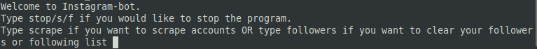
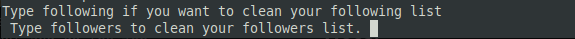
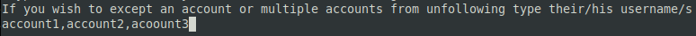

# instagram-bot

> **Instagram-bot** can automates the scraping of followers and following lists, extracts personal account information, and provides tools to clean and manage followers and following lists efficiently. Perfect for enhancing account management and maintaining a curated social media presence.</br>

## Installation needed
>First of all this bot uses **Python** so if you don't have it installed in your machine follow this steps:</br>
>1. If you are on **windows**:</br>
click on [Python](https://www.python.org/downloads/) and download the latest version.
>2. If you are on **linux**:</br>```sudo apt install python3```

>After you successfully downloaded python in your machine install those 2 packages:</br>
>- ```pip3 install seleniumbase```</br>
>- ```pip3 install pandas```

> If you don't have **python3** in your machine **use** ```pip```

>- HINT:</br>
If you faced any problems during seleniumbase instalation i recommend using virtual enviroment, to set up a venv follow the next steps:</br>
Before you set up venv if you are on **linux** you need to download this package --> ```sudo apt install python3.10-venv```</br> 
>>1. Set up venv:</br>
```python3 -m venv venv```</br></br>
>>2. Activate venv:</br>
>>>- If you are on **windows**:</br>
try this -->
```venv\Scripts\activate```</br>
if it didn't work try --> ```venv\Scripts\activate.bat```</br>
>>>- If you are on **linux**:</br>
```source venv/bin/activate```

## Usage

>First step make sure you're in the correct working directory, something like that should appear: </br>
```(venv) ~/Desktop/instagram-bot$```</br>
After that run the following command to start your bot working:</br>
>- ```pytest -k "test_start" -s```</br>

>- HINT</br>
Use ```--headed``` or ```--gui``` to **disable** headless chrome browser</br>

>- **Scraping** </br>
>Once the test has started it will ask you if you want to scrape or automate your followers lists

type scrape to start scraping and provide the informations needed
</br>
When done scraping you will see 

>- **Automating** </br>
To start automating simply type followers from the previous example, then it will ask you for your account's username and password to login to your account and do the job.</br>
After that it will ask you which list you want to clean in your instagram account type following or followers 
>>- If you would like to not unfollow or remove someone from your lists  
sipmly provide their account's username in this structure ```account1,account2,account3,account4```</br>
each account should be **separated with a comma only and with no spaces in between** </br>
And there you go the bot is doing his job


## Note!

>- Using **public** scraping may not work all the time due to some instagram detection. That's because instagram sometimes doesn't **allow** when you're trying to take a look into an account using only link without **login.** 

It's preferred to use private scraping over public scraping due to it's efficiency and getting tasks done
> Choosing private scraping will ask you for your instagram username(not email or phone number) & password to login to your account.<br><br>
>- When using the same account multiple times instagram notices that your doing an automation with your account and will popup a captcha. 
If the captcha poped up you will get an Exception says ***Login to your account and Try solving captcha manually.*** Then you can keep your scraping tasks.
