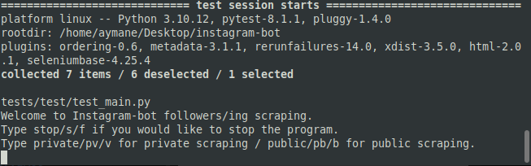
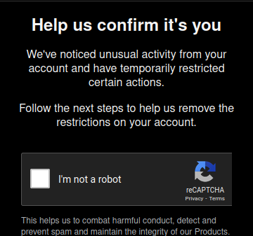
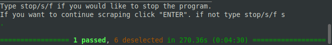
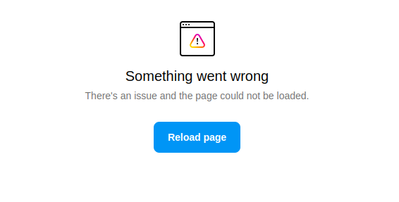

# instagram-bot

> instagram-bot is a bot that scrape only the followers, following and the account information if available such as the username,bio... . All data will be returned as an excel file

## Used packages

```bash
pip3 install seleniumbase
pip3 install pandas
```

> If you don't have **python3** in your machine **use** ```pip```

## Usage

>In your terminal make sure your in the correct directory

```bash
pytest -k "test_start_scrape" -s
```

>Use ```--headed``` or ```--gui``` to **disable** headless chrome browser</br>
Once the test started it will ask you if you want to use public scraping by providing
only account's link or the private scraping



> Choosing private scraping will ask you for your instagram username(not email or phone number) & password to login to your account.</br>
When using the same account multiple times instagram notices that your doing an automation with your account and will popup a captcha. 
If the captcha poped up you will get an Exception says ***Login to your account and Try solving captcha manually.*** Then you can keep your scraping tasks.</br>
when done scraping you will see 

## Note!

>Using **public** scraping may not work all the time due to some instagram issues. That's because instagram sometimes doesn't **allow** when you're trying to take a look into an account using only link without **login.**

It's preferred to use **private** scraping over public scraping due to it's efficiency and getting tasks done
